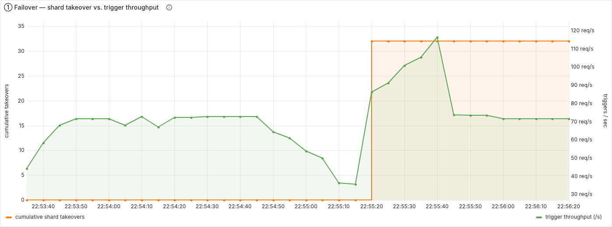
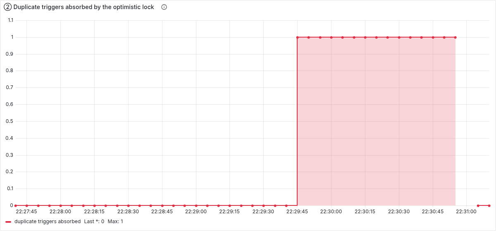
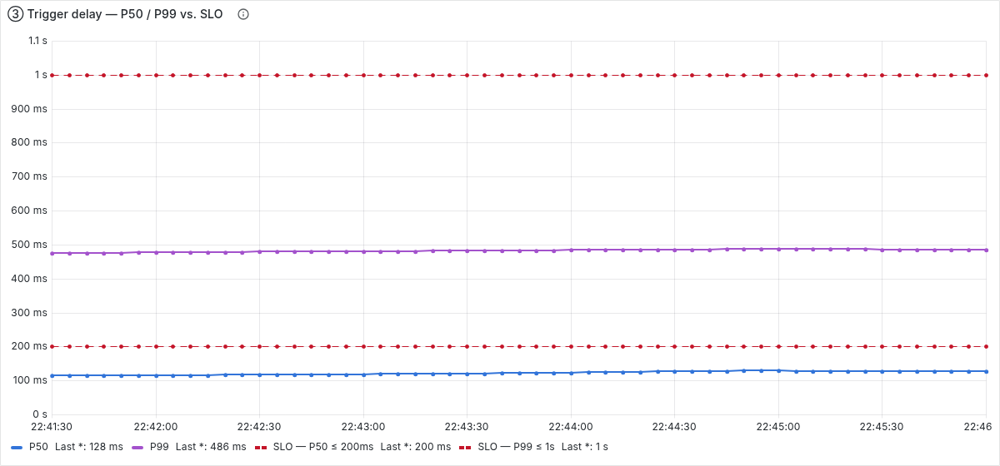

# Chronos

A distributed task scheduler — N identical nodes over one Postgres, no
coordinator. At-least-once firing with a deterministic `triggerId`; a node dying
mid-flight costs a duplicate delivery, never a lost or double-executed task.



**Kill a node under load** and the survivor claims its 32 shards in ~30–40 s
(the 30 s lease TTL, then a heartbeat). Throughput dips while those shards are
dark, then recovers — with a spike as the backlog drains. Nothing in flight is
lost.



**Freeze a node past its lease TTL** (`kill -STOP`). The other re-fires its task
with the same `triggerId`; when the frozen node resumes, its write hits a row
already completed and the optimistic lock makes it a no-op —
`duplicate_trigger_total` steps 0 → 1, the downstream dedups on the `triggerId`,
the action ran once.



**Under 1,000,000 pending rows**, `trigger_delay` (measured on the database
clock) holds P50 ≈ 120 ms / P99 ≈ 480 ms against SLOs of 200 ms / 1 s.

> peak **5,118 triggers/s** (`return 200` downstream — a slow one makes the
> scheduler throttle claiming to match, not pile up) · submit **2,309 TPS** ·
> idle poll cost flat at **3.0 ms**, empty → 1 M pending

---

## What it is

Chronos schedules a callback (`POST` to a `callbackUrl`) to fire at a given
`fireAt`. It runs as N identical nodes against one Postgres. Responsibilities
are split into 64 logical shards; each node leases a fair share and only fires
tasks whose `shard = hash(id) % 64` it currently owns. There is no leader — the
`shards` table *is* the coordination primitive, contended with optimistic locks.

- **Submit** — `POST /tasks` with an `idempotencyKey`; a unique constraint makes
  a retried submit return the existing task, not a duplicate.
- **Fire** — a 200 ms poll claims due tasks with `FOR UPDATE SKIP LOCKED`,
  hands them to a bounded worker pool, and `POST`s the callback. `triggerId` is
  derived from the task id, identical across every retry and every re-fire.
- **Recover** — leases (task and shard) have a TTL. A node that dies just stops
  renewing; its shards and its in-flight tasks are picked up by whoever is still
  polling. Nobody detects the death — the lease clock does the work.
- **Retry / dead-letter** — failed callbacks retry with exponential backoff,
  then move to `dead`.

The full requirements and state machine live in a design doc kept outside the
repo; the ADRs below capture the decisions that shaped the code.

## Running it

```bash
docker compose up -d                 # postgres + prometheus + grafana + renderer
./gradlew bootJar
java -jar build/libs/scheduler-0.0.1-SNAPSHOT.jar --server.port=8080 &
java -jar build/libs/scheduler-0.0.1-SNAPSHOT.jar --server.port=8081 &
```

- API: `http://localhost:8080`
- Grafana (anonymous): `http://localhost:3000/d/chronos-overview` — the panels
  above are provisioned; `grafana/README.md` has the screenshot recipe.
- On WSL2 run `scripts/monitoring-up.sh` instead of `docker compose up` — it
  pins the Prometheus scrape target to the distro IP.

## Design decisions

Recorded as ADRs under [`docs/adr/`](docs/adr). Current:

- **[004 — metrics semantics](docs/adr/004-metrics-semantics.md)** — why each of
  the seven metrics is measured the way it is: trigger delay on the *database*
  clock (so a skewed node can't distort it); `duplicate_trigger` counts a
  duplicate being *absorbed*, not one prevented; the per-shard gauge is the live
  firing count, not the backlog (an exact backlog count is a full-table scan at
  scale).

## Chaos scenarios

Eight scripted failure reproductions under [`scripts/`](scripts) — node kill,
persistent downstream failure, concurrent duplicate submit, cancel-vs-fire race,
network partition, node freeze, clock skew, clock drift. Scenarios 1–4, 7, 8 also
run in CI as Testcontainers tests (`.github/workflows/ci.yml`); 5 and 6 stay as
dev scripts because they need `kill -STOP` / a TCP proxy.

Highlights the tests pin down:

- **Clock drift** — the design tolerates a node clock as slow as **1/3 real
  speed**; at exactly `heartbeat_period / lease_ttl` both safety margins
  collapse against the TTL at once. `ClockDriftTest` confirms the coefficient
  from both sides.
- **Shard rebalance** — a node that loses the startup race and finds every
  shard leased force-claims one to stay visible, then downward-rebalances;
  `ShardRebalanceConvergenceTest` proves it converges to a fixed point and
  *stops*, no oscillation.

## Load test

Numbers, methods, query plans, and the measure→tune before/after in
[`docs/performance.md`](docs/performance.md). Re-run with
`scripts/loadtest.sh {plans|capacity|peak|submit}`.
